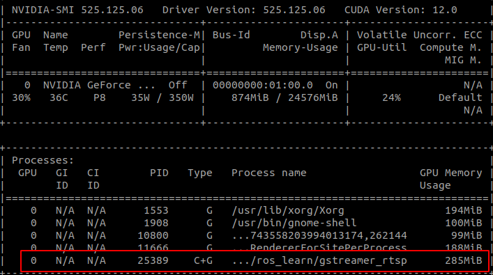

# ubuntu下opencv环境配置

## 本文使用环境为
 -  nvidia-driver 525.125.06
 -  cuda 11.4
 -  cudnn 8.4.0
 -  opencv 4.5.1 
 -  nvidia vedio codec sdk 11.1.5

 ==需要注意的是，nvcodec有最低支持的显卡驱动版本要求==

 ## opencv安装与编译
 1. 下载opencv-4.5.1与opencv-contrib-4.5.1
    [opencv传送门](https://opencv.org/releases/)
    [opencv-contrib传送门](https://github.com/opencv/opencv_contrib/tags)

 2. 将上面两个文件夹放到一个文件夹下，在/usr/local/目录下创建文件夹opencv-4.5.1(库将安装到这个目录下)
 3. 删除其他所有的opencv版本（我是这么做的，因为会出现很多的警告）
    ```xml
    cd /usr
    sudo find . -name "*opencv*" | xargs sudo rm -rf
    ```
 4. 下载nvdio vedio codec sdk， 将inference下的头文件拷贝到cuda include目录下 
 5. OpenCVDetectCUDA.cmake下，将61行变成
   ```xml
   # PATHS "${CUDA_TOOLKIT_TARGET_DIR}" "${CUDA_TOOLKIT_ROOT_DIR}" 原始的
   PATHS "${CUDA_TOOLKIT_TARGET_DIR}" "${CUDA_TOOLKIT_ROOT_DIR}" "/usr/include" "/usr/local/include/ffnvcodec" #更改后的
   ```
 6. 进入opencv-contrib cudacodec  下找到precomp.hpp，添加头文件 `#include <nvcuvid.h>`
 7. 编译opencv
 
 ```xml
    cmake -D CMAKE_BUILD_TYPE=RELEASE \
    -D CMAKE_INSTALL_PREFIX=/usr/local/opencv-4.5.1 \
    -D INSTALL_PYTHON_EXAMPLES=ON \
    -D INSTALL_C_EXAMPLES=ON \
    -D OPENCV_EXTRA_MODULES_PATH=../../opencv_contrib-4.5.1/modules \
    -D PYTHON3_EXECUTABLE=/usr/bin/python3 \
    -D PYTHON_EXECUTABLE=/usr/bin/python \
    -D WITH_TBB=ON \
    -D WITH_V4L=ON \
    -D WITH_QT=ON \
    -D WITH_GTK=ON \
    -D WITH_VTK=ON \
    -D WITH_OPENGL=ON \
    -D WITH_OPENMP=ON\
    -D BUILD_EXAMPLES=ON \
    -D CUDA_TOOLKIT_ROOT_DIR=/usr/local/cuda \
    -D WITH_CUDA=ON \
    -D WITH_CUDNN=ON \
    -D ENABLE_FAST_MATH=ON \
    -D CUDA_FAST_MATH=1 \
    -D WITH_NVCUVID=ON \
    -D WITH_CUBLAS=1 \
    -D ENABLE_PRECOMPILED_HEADERS=OFF\
    -D INSTALL_PYTHON_EXAMPLES=ON \
    -D OPENCV_GENERATE_PKGCONFIG=ON \
    -D OPENCV_ENABLE_NONFREE=ON \
    -D WITH_GSTREAMER=ON \
    -D WITH_LZ4=ON \
    -D PYTHON_DEFAULT_EXECUTABLE=$(which python3) \
    -D CUDA_nppicom_LIBRARY=stdc++ \	
    -D CUDA_ARCH_BIN="8.6"  ..
 
 ```
 ```xml
 make -j6  #make -j 会卡住
 ```
 ```xml
 sudo make install
 ```

 8. 测试拉流代码
```cpp
#include "opencv2/opencv_modules.hpp"
#include <iostream>
#if defined(HAVE_OPENCV_CUDACODEC)
#include <algorithm>
#include <numeric>
#include <opencv2/core.hpp>
#include <opencv2/core/opengl.hpp>
#include <opencv2/cudacodec.hpp>
#include <opencv2/highgui.hpp>
#include <string>
#include <vector>

int main(int argc, const char* argv[])
{
    const std::string fname = "/home/zqh/test.mp4";

    cv::namedWindow("CPU", cv::WINDOW_NORMAL);

    cv::namedWindow("GPU", cv::WINDOW_OPENGL);
    std::cout << "gpus=" << cv::cuda::getCudaEnabledDeviceCount() << std::endl;
    cv::cuda::setGlDevice();

    cv::Mat frame;
    cv::VideoCapture reader(fname);

    cv::cuda::GpuMat d_frame;
    cv::Ptr<cv::cudacodec::VideoReader> d_reader = cv::cudacodec::createVideoReader(fname);
    std::cout << "开始在gpu上运行" << std::endl;

    cv::TickMeter tm;
    std::vector<double> cpu_times;
    std::vector<double> gpu_times;

    int gpu_frame_count = 0, cpu_frame_count = 0;

    for (;;) {
        tm.reset();
        tm.start();
        if (!reader.read(frame))
            break;
        tm.stop();
        cpu_times.push_back(tm.getTimeMilli());
        cpu_frame_count++;

        cv::imshow("CPU", frame);

        if (cv::waitKey(3) > 0)
            break;
    }

    for (;;) {
        tm.reset();
        tm.start();
        if (!d_reader->nextFrame(d_frame))
            break;
        tm.stop();
        gpu_times.push_back(tm.getTimeMilli());
        gpu_frame_count++;

        cv::imshow("GPU", d_frame);

        if (cv::waitKey(3) > 0)
            break;
    }

    if (!cpu_times.empty() && !gpu_times.empty()) {
        std::cout << std::endl
                  << "Results:" << std::endl;

        std::sort(cpu_times.begin(), cpu_times.end());
        std::sort(gpu_times.begin(), gpu_times.end());

        double cpu_avg = std::accumulate(cpu_times.begin(), cpu_times.end(), 0.0) / cpu_times.size();
        double gpu_avg = std::accumulate(gpu_times.begin(), gpu_times.end(), 0.0) / gpu_times.size();

        std::cout << "CPU : Avg : " << cpu_avg << " ms FPS : " << 1000.0 / cpu_avg << " Frames " << cpu_frame_count << std::endl;
        std::cout << "GPU : Avg : " << gpu_avg << " ms FPS : " << 1000.0 / gpu_avg << " Frames " << gpu_frame_count << std::endl;
    }

    return 0;
}

#else

int main()
{
    std::cout << "OpenCV was built without CUDA Video decoding support\n"
              << std::endl;
    return 0;
}

#endif
```



   
