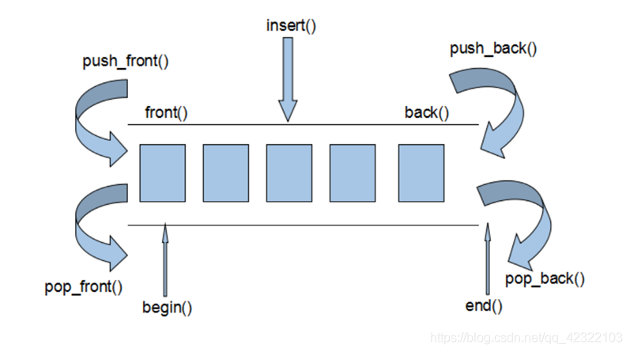

@[TOC](STL学习)
# 六大组件简介
1. **容器**
   各种数据结构，如vector、list、deque、set、map等,用来存放数据，从实现角度来看，STL容器是一种class template
2. **算法**
   各种常用的算法，如sort、find、copy、for_each。从实现的角度来看，STL算法是一种function tempalte
3. **迭代器**
   扮演了容器与算法之间的胶合剂，共有五种类型，从实现角度来看，迭代器是一种将operator* , operator-> , operator++,operator–等指针相关操作予以重载的class template. 所有STL容器都附带有自己专属的迭代器，只有容器的设计者才知道如何遍历自己的元素。原生指针(native pointer)也是一种迭代器

4. **仿函数**
   行为类似函数，可作为算法的某种策略。从实现角度来看，仿函数是一种重载了operator()的class 或者class template  <font color = "green"> 说白了仿函数就是让类具有函数的功能，形成一种闭包 </font>
5. **适配器**
   一种用来修饰容器或者仿函数或迭代器接口的东西
6. **空间配置器**
   负责空间的配置与管理。从实现角度看，配置器是一个实现了动态空间配置、空间管理、空间释放的class tempalte

==STL六大组件的交互关系，容器通过空间配置器取得数据存储空间，算法通过迭代器存储容器中的内容，仿函数可以协助算法完成不同的策略的变化，适配器可以修饰仿函数==

# 容器

## vector
1. **特点**
- ==内存空间连续==，随机访问效率高
- 插入或者删除某个元素，需要将现有元素进行复制移动，效率不高，如果是从尾部插入的话元素不用移动
- 每次都以两倍的容量进行扩张，适合小对象，并且实际配置的时候应该要比客户需求的大一点
- 所谓动态增加大小，其实是申请一块更大的空间，将原有数据拷贝到新空间，然后释放掉原空间，<font color ="green"> 一旦引起空间的重新配置，指向原vector的所有迭代器就都失效了 </font> 

2. **vector构造函数**

```cpp
vector<T> v; //采用模板实现类实现，默认构造函数
vector(v.begin(), v.end());//将v[begin(), end())区间中的元素拷贝给本身。
vector(n, elem);//构造函数将n个elem拷贝给本身。
vector(const vector &vec);//拷贝构造函数。
```

3. **常用赋值操作**
```cpp
assign(beg, end);//将[beg, end)区间中的数据拷贝赋值给本身。
assign(n, elem);//将n个elem拷贝赋值给本身。
vector& operator=(const vector  &vec);//重载等号操作符
swap(vec);// 将vec与本身的元素互换
```

4. **大小操作**
```cpp
size();//返回容器中元素的个数
empty();//判断容器是否为空
resize(int num);//重新指定容器的长度为num，若容器变长，则以默认值填充新位置。如果容器变短，则末尾超出容器长度的元素被删除。
resize(int num, elem);//重新指定容器的长度为num，若容器变长，则以elem值填充新位置。如果容器变短，则末尾超出容器长>度的元素被删除。
capacity();//容器的容量
reserve(int len);//容器预留len个元素长度，预留位置不初始化，元素不可访问。
```

5. **数据存储操作**
```cpp
at(int idx); //返回索引idx所指的数据，如果idx越界，抛出out_of_range异常。
operator[];//返回索引idx所指的数据，越界时，运行直接报错
front();//返回容器中第一个数据元素
back();//返回容器中最后一个数据元素
```
6. **插入和删除操作**
```cpp
insert(const_iterator pos, int count,ele);//迭代器指向位置pos插入count个元素ele.
push_back(ele); //尾部插入元素ele
pop_back();//删除最后一个元素
erase(const_iterator start, const_iterator end);//删除迭代器从start到end之间的元素
erase(const_iterator pos);//删除迭代器指向的元素
clear();//删除容器中所有元素
```

==resize和reserve的区别==
- resize 重新指定容器大小，若变长，以默认值填充；若变短，超出长度部分会被删掉
- reserve 容器预留n个元素的长度，预留位置不初始化，元素不可访问；主要是为了避免多次不必要的扩容

### vector代码示例


## list

1. **特点**
- ==内存空间不连续==,因为是靠指针连接的
- 每个元素维护一个前向指针和一个后向指针，因此支持前向遍历和后向遍历
- 随机的插入和删除工作效率比较高，但随机访问效率低下，且需要额外维护指针，且开销比较大
- 适用于对象数量变化大，对象复杂，插入和删除频繁的工作

2. **list容器的迭代器**
- List容器不能像vector一样以普通指针作为迭代器，因为其节点不能保证在同一块连续的内存空间上
- 是一个双向链表，迭代器必须能够具备前移、后移的能力，所以list容器提供的是Bidirectional Iterators
- 插入操作和删除操作都不会造成原有list迭代器的失效

3. **构造函数**
```cpp
list<T> lstT;//list采用模板类实现,对象的默认构造形式：
list(beg,end);//构造函数将[beg, end)区间中的元素拷贝给本身。
list(n,elem);//构造函数将n个elem拷贝给本身。
list(const list &lst);//拷贝构造函数。
```

4. **插入和删除**
```cpp
push_back(elem);//在容器尾部加入一个元素
pop_back();//删除容器中最后一个元素
push_front(elem);//在容器开头插入一个元素
pop_front();//从容器开头移除第一个元素
insert(pos,elem);//在pos位置插elem元素的拷贝，返回新数据的位置。
insert(pos,n,elem);//在pos位置插入n个elem数据，无返回值。
insert(pos,beg,end);//在pos位置插入[beg,end)区间的数据，无返回值。
clear();//移除容器的所有数据
erase(beg,end);//删除[beg,end)区间的数据，返回下一个数据的位置。
erase(pos);//删除pos位置的数据，返回下一个数据的位置。
remove(elem);//删除容器中所有与elem值匹配的元素。
```

5. **大小操作**
```cpp
size();//返回容器中元素的个数
empty();//判断容器是否为空
resize(num);//重新指定容器的长度为num，
若容器变长，则以默认值填充新位置。
如果容器变短，则末尾超出容器长度的元素被删除。
resize(num, elem);//重新指定容器的长度为num，
若容器变长，则以elem值填充新位置。
如果容器变短，则末尾超出容器长度的元素被删除。
```
6. **赋值操作**
```cpp
assign(beg, end);//将[beg, end)区间中的数据拷贝赋值给本身。
assign(n, elem);//将n个elem拷贝赋值给本身。
list& operator=(const list &lst);//重载等号操作符
swap(lst);//将lst与本身的元素互换。
```

7. **数据的存取**
```cpp
front();//返回第一个元素。
back();//返回最后一个元素。
```
8. **反转排序**
```cpp
reverse();//反转链表，比如lst包含1,3,5元素，运行此方法后，lst就包含5,3,1元素。
sort(); //list排序
```

## deque

1. **特点**
- vector 是单向开口的连续空间， deque是则是一种双向开口的连续空间（可以在在头尾两端分别做元素的插入和删除操作）
- deque没有容量的概念，因为它是动态的以分段连续空间组合而成，随时可以增加一段新的空间并链接起来
- 其迭代器并不是普通的指针，其复杂度和vector不是一个量级，会影响各个运算的层面，应该尽可能的使用vector，而不是deque
- 为了最高效率，可将deque先完整的复制到一个vector中，对vector容器进行排序，再复制回deque

2. **构造函数**
```cpp
deque<T> deqT;//默认构造形式
deque(beg, end);//构造函数将[beg, end)区间中的元素拷贝给本身。
deque(n, elem);//构造函数将n个elem拷贝给本身。
deque(const deque &deq);//拷贝构造函数。
```

3. **赋值操作**
```cpp
assign(beg, end);//将[beg, end)区间中的数据拷贝赋值给本身。
assign(n, elem);//将n个elem拷贝赋值给本身。
deque& operator=(const deque &deq); //重载等号操作符 
swap(deq);// 将deq与本身的元素互换
```

4. **大小操作**
```cpp
deque.size();//返回容器中元素的个数
deque.empty();//判断容器是否为空
deque.resize(num);//重新指定容器的长度为num,若容器变长，则以默认值填充新位置。如果容器变短，则末尾超出容器长度的元素被删除。
deque.resize(num, elem); //重新指定容器的长度为num,若容器变长，则以elem值填充新位置,如果容器变短，则末尾超出容器长度的元素被删除。
```

5. **双端插入和删除操作**
```cpp
push_back(elem);//在容器尾部添加一个数据
push_front(elem);//在容器头部插入一个数据
pop_back();//删除容器最后一个数据
pop_front();//删除容器第一个数据
```

6. **数据存取**
```cpp
at(idx);//返回索引idx所指的数据，如果idx越界，抛出out_of_range。
operator[];//返回索引idx所指的数据，如果idx越界，不抛出异常，直接出错。
front();//返回第一个数据。
back();//返回最后一个数据
```
7. **插入操作**
```cpp
insert(pos,elem);//在pos位置插入一个elem元素的拷贝，返回新数据的位置。
insert(pos,n,elem);//在pos位置插入n个elem数据，无返回值。
insert(pos,beg,end);//在pos位置插入[beg,end)区间的数据，无返回值。
```
8. **删除操作**
```cpp
clear();//移除容器的所有数据
erase(beg,end);//删除[beg,end)区间的数据，返回下一个数据的位置。
erase(pos);//删除pos位置的数据，返回下一个数据的位置。
```


## vector list deque 比较


| 容器   | 优点                                                                                                         | 缺点                                                                                                                        | 应用场景                                                                                                                                                                      |
| ------ | ------------------------------------------------------------------------------------------------------------ | --------------------------------------------------------------------------------------------------------------------------- | ----------------------------------------------------------------------------------------------------------------------------------------------------------------------------- |
| vector | 1.随机访问方便，支持下标访问和vector.at()操作<br>2. 节省空间                                                 | 1.在内部进行插入删除，效率较低<br>2.只能在末端进行pop和push <br> 3.当动态长度超过默认分配大小后，要整体重新分配、拷贝和释放 | 1.随机访问操作，则选择vector <br>2.若已经知道需要存储元素的数目，则选择vector<br>3. 需要高效的随即存取，而不在乎插入和删除的效率，使用vector                                  |
| list   | 1.不使用连续内存完成动态操作<br>2.在内部方便的进行插入和删除操作 <br> 3. 可在两端进行push、pop(循环双向链表) | 1.不能进行内部的随机访问，即不支持[ ]操作符和.at()<br>2.相对于verctor占用内存多                                             | 1.需要大量的插入和删除，而不关心随机存取，则应使用list      <br> 2. 存储的是大型负责类对象时，list要优于vector；当然这时候也可以用vector来存储指向对象的指针                  |
| deque  | 1.随机访问方便，支持[]操作符和.at<br> 2.在内部方便的进行插入和删除操作<br>3. 可在两端进行push、pops          | 占用内存多，因为内部迭代器复杂                                                                                              | 1.只有需要在首端进行插入/删除操作的时候，还要兼顾随机访问效率，才选择deque，否则都选择vector   <br>2. 需要随机插入/删除，又需要随机访问，则需要在vector与list间做个折中-deque |

## set/multiset
1. **特点**
- 元素既是键值也是实值
- 会根据元素的值自动排序
- 不允许两个元素同时拥有相同的键值
- 不允许通过迭代器更改元素的值
- 当对容器中的元素进行插入操作或者删除操作的时候，操作之前所有的迭代器，在操作完成之后依然有效

2. **构造函数**
```cpp
set<T> st;//set默认构造函数：
mulitset<T> mst; //multiset默认构造函数: 
set(const set &st);//拷贝构造函数
```
3. **赋值操作**
```cpp
set& operator=(const set &st);//重载等号操作符
swap(st);//交换两个集合容器
```
4. **大小操作**
```cpp
size();//返回容器中元素的数目
empty();//判断容器是否为空
```
5. **插入和删除操作**
```cpp
insert(elem);//在容器中插入元素。
clear();//清除所有元素
erase(pos);//删除pos迭代器所指的元素，返回下一个元素的迭代器。
erase(beg, end);//删除区间[beg,end)的所有元素 ，返回下一个元素的迭代器。
erase(elem);//删除容器中值为elem的元素
```
6. **查找操作**
```cpp
find(key);//查找键key是否存在,若存在，返回该键的元素的迭代器；若不存在，返回set.end();
count(key);//查找键key的元素个数
lower_bound(keyElem);//返回第一个key>=keyElem元素的迭代器。
upper_bound(keyElem);//返回第一个key>keyElem元素的迭代器。
equal_range(keyElem);//返回容器中key与keyElem相等的上下限的两个迭代器。
```
   

## map/multimap
1. **特点**
- 所有元素都会根据元素的键值自动排序
- map所有元素都是pair，即同时拥有键值和实值；pair的第一个元素被视为键值，第二个为实值；
- 不允许两个元素有相同的键值
- 不可以通过迭代器更改map的键值，那会破坏map组织
- 可以修改实值
- 对元素进行删除和添加操作时，之前的迭代器在操作完之后依然有效
- 底层机制是红黑树
- multimap唯一的区别是键值可以重复

2. **构造函数**
```cpp
map<T1, T2> mapTT;//map默认构造函数: 
map(const map &mp);//拷贝构造函数
```
3. **赋值操作**
```cpp
map& operator=(const map &mp);//重载等号操作符
swap(mp);//交换两个集合容器
```
4. **大小操作**
```cpp
size();//返回容器中元素的数目
empty();//判断容器是否为空
```
5. **插入元素**
```cpp
map.insert(...); //往容器插入元素，返回pair<iterator,bool>
map<int, string> mapStu;
// 第一种 通过pair的方式插入对象
mapStu.insert(pair<int, string>(3, "小张"));
// 第二种 通过pair的方式插入对象
mapStu.inset(make_pair(-1, "校长"));
// 第三种 通过value_type的方式插入对象
mapStu.insert(map<int, string>::value_type(1, "小李"));
// 第四种 通过数组的方式插入值
mapStu[3] = "小刘";
mapStu[5] = "小王";
```
6. **删除操作**
```cpp
clear();//删除所有元素
erase(pos);//删除pos迭代器所指的元素，返回下一个元素的迭代器。
erase(beg,end);//删除区间[beg,end)的所有元素 ，返回下一个元素的迭代器。
erase(keyElem);//删除容器中key为keyElem的对组。
```
7. **查找操作**
```cpp
find(key);//查找键key是否存在,若存在，返回该键的元素的迭代器；/若不存在，返回map.end();
count(keyElem);//返回容器中key为keyElem的对组个数。对map来说，要么是0，要么是1。对multimap来说，值可能大于1。
lower_bound(keyElem);//返回第一个key>=keyElem元素的迭代器。
upper_bound(keyElem);//返回第一个key>keyElem元素的迭代器。
equal_range(keyElem);//返回容器中key与keyElem相等的上下限的两个迭代器。
```

## stack
1. **特点**
- 先进后出
- 只有顶端元素才有可能被外界取用
- 没有遍历功能， 也不提供迭代器

2. **构造函数**
```cpp
stack<T> stkT;//stack采用模板类实现， stack对象的默认构造形式： 
stack(const stack &stk);//拷贝构造函数
```
3. **赋值操作**
```cpp
stack& operator=(const stack &stk);//重载等号操作符
```

4. **数据存取操作**
```cpp
push(elem);//向栈顶添加元素
pop();//从栈顶移除第一个元素
top();//返回栈顶元素
```

5. **大小操作**
```cpp
empty();//判断堆栈是否为空
size();//返回堆栈的大小
```

## queue

1. **特点**
- 先进先出
- 只有顶端元素才有可能被外界取用
- 没有遍历功能， 也不提供迭代器
  
2. **构造函数**
```cpp
queue<T> queT;//queue采用模板类实现，queue对象的默认构造形式：
queue(const queue &que);//拷贝构造函数
```
3. **存取、插入和删除操作**
```cpp
push(elem);//往队尾添加元素
pop();//从队头移除第一个元素
back();//返回最后一个元素
front();//返回第一个元素
```
4. **赋值操作**
```cpp
queue& operator=(const queue &que);//重载等号操作符
```
5. **大小操作**
```cpp
empty();//判断队列是否为空
size();//返回队列的大小
```

# 常用算法
## 遍历算法
| 函数                                                                  | 参数意义                                                                            | 作用                                                                       | 优缺点           |
| --------------------------------------------------------------------- | ----------------------------------------------------------------------------------- | -------------------------------------------------------------------------- | ---------------- |
| ==for_each==(iterator beg, iterator end, _callback)                   | 开始迭代器、结束迭代器、函数回调或者函数对象； 返回函数对象                         | 用指定函数依次对指定范围内所有元素进行迭代访问。该函数不得修改序列中的元素 | 速度快，不灵活   |
| ==transform==(iterator beg1, iterator end1, iterator beg2, _callback) | 开始迭代器、结束迭代器、目标容器开始迭代器=回调函数或者函数对象；返回目标容器迭代器 | 将指定容器区间元素搬运到另一容器中， ==需要提前分配好内存==                | 速度慢，非常灵活 |

### for_each代码示例
```cpp


```

### transform 代码示例
```cpp

```

## 查找算法

| 函数                                                      | 参数意义&返回值                                                             | 作用                                                         |
| --------------------------------------------------------- | --------------------------------------------------------------------------- | ------------------------------------------------------------ |
| ==find==(iterator beg, iterator end, value)               | 开始迭代器、结束迭代器、查找的元素； 返回查找元素的位置                     | 查找元素                                                     |
| ==find_if==(iterator beg, iterator end, _callback)        | 开始迭代器、结束迭代器、回调函数或者谓词；查找返回true 否则false            | 条件查找                                                     |
| ==adjacent_find==(iterator beg, iterator end, _callback)  | 开始迭代器、结束迭代器、回调函数或者谓词； 返回相邻元素的第一个位置的迭代器 | 查找相邻重复元素                                             |
| ==bool binary_search==(iterator beg, iterator end, value) | 开始迭代器、结束迭代器、查找的元素; 返回true或者false                       | 二分查找法； <font color = "red"> 在无序序列中不可用 </font> |
| ==count==(iterator beg, iterator end, value)              | 开始迭代器、结束迭代器、回调函数或者谓词； 返回元素个数                     | 统计元素出现次数                                             |
| ==count_if==(iterator beg, iterator end, _callback)       | 开始迭代器、结束迭代器、回调函数或者谓词； 返回元素个数                     | 统计元素出现次数                                             |

### 代码示例
```cpp


```

## 排序算法

| 函数                                                                                 | 参数意义&返回值                                        | 作用                                                            |
| ------------------------------------------------------------------------------------ | ------------------------------------------------------ | --------------------------------------------------------------- |
| ==merge==(iterator beg1, iterator end1, iterator beg2, iterator end2, iterator dest) | 容器1开始、结束、容器2开始、结束；返回目标容器的迭代器 | 容器元素合并，并存储到另一容器中                                |
| ==sort==(iterator beg, iterator end, _callback)                                      | 开始迭代器、结束迭代器、回调函数或者谓词；             | 容器元素排序  <font color = "red"> 两个容器必须是有序的 </font> |
| ==random_shuffle==(iterator beg, iterator end)                                       | 开始迭代器、结束迭代器                                 | 对指定范围内的元素随机调整次序                                  |
| ==reverse==(iterator beg, iterator end)                                              | 开始迭代器、结束迭代器                                 | 反转指定范围的元素                                              |


## 常用拷贝和替换算法
| 函数                                                            | 参数意义&返回值                                  | 作用                                       |
| --------------------------------------------------------------- | ------------------------------------------------ | ------------------------------------------ |
| ==copy==(iterator beg, iterator end, iterator dest)             | 开始迭代器、结束迭代器、目标容器开始迭代器       | 将容器内指定范围的元素拷贝到另一容器中     |
| ==replace==(iterator beg, iterator end, oldvalue, newvalue)     | 开始迭代器、结束迭代器、旧元素、新元素           | 将容器内指定范围的旧元素修改为新元素       |
| ==replace_if==(iterator beg, iterator end, _callback, newvalue) | 开始迭代器、结束迭代器、回调函数或者谓词、新元素 | 将容器内指定范围满足条件的元素替换为新元素 |
| ==swap==(container c1, container c2)                            | 容器1, 容器2                                     | 互换两个容器的元素                         |


### 代码示例
```cpp


```

## 算数生成算法
| 函数                                              | 参数意义&返回值                  | 作用                 |
| ------------------------------------------------- | -------------------------------- | -------------------- |
| ==accumulate==(iterator beg, iterator end, value) | 开始迭代器、结束迭代器、累加值   | 计算容器元素累计总和 |
| fill(iterator beg, iterator end, value)           | 开始迭代器、结束迭代器、填充元素 | 向容器中添加元素     |

## 集合算法
| 函数                                                                                            | 参数意义&返回值                                                                            | 作用                                                                      |
| ----------------------------------------------------------------------------------------------- | ------------------------------------------------------------------------------------------ | ------------------------------------------------------------------------- |
| ==set_intersection==(iterator beg1, iterator end1, iterator beg2, iterator end2, iterator dest) | 容器1开始、结束、容器2开始、结束、目标容器开始迭代器；返回目标容器最后一个元素的迭代器地址 | 求两个set集合的交集；<font color ="red" >两个集合必须是有序序列  </font>  |
| ==set_union==(iterator beg1, iterator end1, iterator beg2, iterator end2, iterator dest)        | 容器1开始、结束、容器2开始、结束、目标容器开始迭代器；返回目标容器最后一个元素的迭代器地址 | 求两个set集合的并集 ；<font color ="red" >两个集合必须是有序序列  </font> |
| ==set_difference==(iterator beg1, iterator end1, iterator beg2, iterator end2, iterator dest)   | 容器1开始、结束、容器2开始、结束、目标容器开始迭代器；返回目标容器最后一个元素的迭代器地址 | 求两个set集合的差集 ；<font color ="red" >两个集合必须是有序序列  </font> |