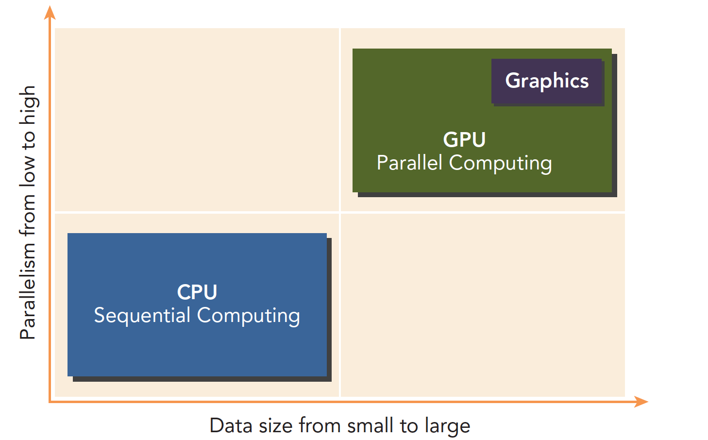
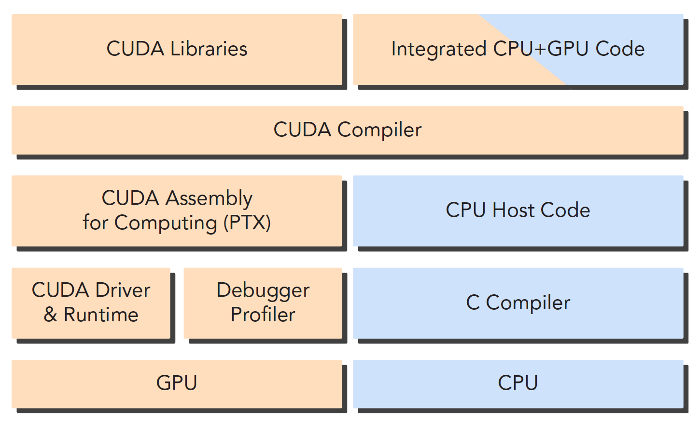

# 异构计算与CUDA


1. 左图：一个四核CPU一般有四个ALU，ALU是完成逻辑计算的核心，也是我们平时说四核八核的核，控制单元，缓存也在片上，DRAM是内存，一般不在片上，CPU通过总线访问内存。
2. 右图：GPU，绿色小方块是ALU，我们注意红色框内的部分SM，这一组ALU公用一个Control单元和Cache，这个部分相当于一个完整的多核CPU，但是不同的是ALU多了，control部分变小，可见计算能力提升了，控制能力减弱了，所以对于控制（逻辑）复杂的程序，一个GPU的SM是没办法和CPU比较的，但是对了逻辑简单，数据量大的任务，GPU更搞笑，并且，注意，一个GPU有好多个SM，而且越来越多。


## CPU和GPU区别：




### 适合的任务不同
   
```xml
低并行逻辑复杂的程序适合用CPU
高并行逻辑简单的大数据计算适合GPU
```

### 线程的区别
```xml
1. CPU线程是重量级实体，操作系统交替执行线程，线程上下文切换花销很大

2. GPU线程是轻量级的，GPU应用一般包含成千上万的线程，多数在排队状态，线程之间切换基本没有开销。

3. CPU的核被设计用来尽可能减少一个或两个线程运行时间的延迟，而GPU核则是大量线程，最大幅度提高吞吐量
```


## CUDA：一种异构计算平台


```xml
驱动API是低级的API，使用相对困难，运行时API是高级API使用简单，其实现基于驱动API

这两种API是互斥的，也就是你只能用一个，两者之间的函数不可以混合调用，只能用其中的一个库
```




```xml
CUDA nvcc编译器会自动分离你代码里面的不同部分，如图中主机代码用C写成，使用本地的C语言编译器编译，设备端代码，
也就是核函数，用CUDA C编写，通过nvcc编译，链接阶段，在内核程序调用或者明显的GPU设备操作时，添加运行时库;

核函数是我们后面主要接触的一段代码，就是设备上执行的程序段;
```


### cuda程序步骤

```xml
分配GPU内存
拷贝内存到设备
调用CUDA内核函数来执行计算
把计算完成数据拷贝回主机端
内存销毁
```

### 关于cuda c

1. 目前计算设备的架构决定了局部性将会严重影响效率，数据局部性分为：
   ```xml
   空间局部性
   时间局部性
   ``` 
   这个两个性质告诉我们，当一个数据被使用，其附近的数据将会很快被使用，当一个数据刚被使用，则随着时间继续其被再次使用的可能性降低，数据可能被重复使用。
