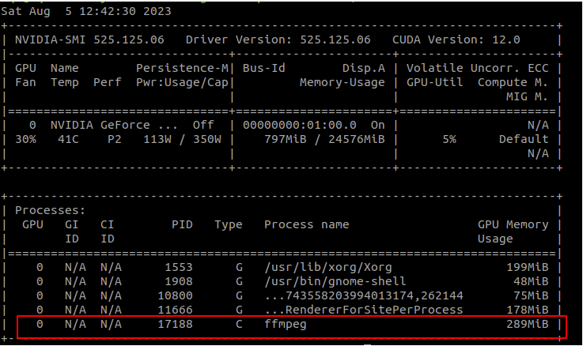

# ffmpeg+rtsp-simple-server 推流

1. 检查ffmpeg是否支持硬件加速以及硬件编码与解码
   ```xml
   ffmpeg -encoders | grep nvenc
   ```
   a. 如果支持，终端打印：
   ```xml
    ffmpeg version 3.4.8 Copyright (c) 2000-2020 the FFmpeg developers
    built with gcc 9 (Ubuntu 9.4.0-1ubuntu1~20.04.1)
    configuration: --enable-gpl --enable-version3 --enable-nonfree --enable-shared --enable-ffmpeg --enable-ffplay --enable-ffprobe --enable-ffserver --enable-libx264 --enable-nvenc --enable-cuda --enable-cuvid --enable-libnpp --extra-cflags=-I/usr/local/cuda/include --extra-ldflags=-L/usr/local/cuda/lib64
    libavutil      55. 78.100 / 55. 78.100
    libavcodec     57.107.100 / 57.107.100
    libavformat    57. 83.100 / 57. 83.100
    libavdevice    57. 10.100 / 57. 10.100
    libavfilter     6.107.100 /  6.107.100
    libswscale      4.  8.100 /  4.  8.100
    libswresample   2.  9.100 /  2.  9.100
    libpostproc    54.  7.100 / 54.  7.100
    V..... h264_nvenc           NVIDIA NVENC H.264 encoder (codec h264)
    V..... nvenc                NVIDIA NVENC H.264 encoder (codec h264)
    V..... nvenc_h264           NVIDIA NVENC H.264 encoder (codec h264)
    V..... nvenc_hevc           NVIDIA NVENC hevc encoder (codec hevc)
    V..... hevc_nvenc           NVIDIA NVENC hevc encoder (codec hevc)
   ```

   b. 如果不支持，则安装编译ffmpeg， 源码安装或者二进制安装，网上资料很多

2. 安装rtsp-simple-server

    ```xml
    https://github.com/bluenviron/mediamtx/releases
    ```
    下载完成后解压，直接./运行可执行文件即可


3. 测试ffmpeg硬件推流

    ```cpp
    #include <fstream>
    #include <iostream>
    #include <mutex>
    #include <opencv2/opencv.hpp>
    #include <queue>
    #include <ros/ros.h>
    #include <sensor_msgs/Image.h>
    #include <signal.h>
    #include <stdio.h>
    #include <stdlib.h>
    #include <thread> // Add this line to include the <thread> header
    #include <unistd.h>

    using namespace std;

    ros::Subscriber image_sub;
    FILE* ffmpeg_process;
    mutex buffer_mutex;
    queue<vector<uint8_t>> image_buffer;

    void imageCallback(const sensor_msgs::Image::ConstPtr& msg)
    {
        // cout << "收到图像" << endl;

        try {
            // 获取图像数据
            const std::vector<uint8_t>& image_data = msg->data;

            // 将图像数据放入缓冲区
            lock_guard<mutex> lock(buffer_mutex);
            image_buffer.push(image_data);

        } catch (const std::exception& e) {
            ROS_ERROR("处理图像数据时出错：%s", e.what());
        }
    }

    void processImageBuffer()
    {

        while (ros::ok()) {
            ros::spinOnce();
            ros::Duration(0.01).sleep();

            double start_time = cv::getTickCount();
            // 等待获取锁
            lock_guard<mutex> lock(buffer_mutex);

            // 检查是否有图像数据
            if (image_buffer.empty()) {
                continue;
            }

            // 获取图像数据
            const std::vector<uint8_t>& image_data = image_buffer.front();

            // 将图像数据传递给 ffmpeg 的标准输入
            fwrite(image_data.data(), sizeof(uint8_t), image_data.size(), ffmpeg_process);

            double end_time = cv::getTickCount();
            // double elapsed_time_ms = (end_time - start_time) / cv::getTickFrequency() * 1000;
            // std::cout << "执行时间：" << elapsed_time_ms << " 毫秒" << std::endl;

            // 弹出已处理的图像数据
            image_buffer.pop();
        }
    }

    void sigintHandler(int sig)
    {
        // 关闭 ffmpeg 进程
        if (ffmpeg_process) {
            fclose(ffmpeg_process);
            ffmpeg_process = nullptr;
        }
        ros::shutdown();
    }

    int main(int argc, char** argv)
    {
        ros::init(argc, argv, "image_to_ffmpeg");

        // 初始化 ROS 节点
        ros::NodeHandle nh;

        // 订阅 ROS 图像话题（根据实际话题名称进行订阅）
        image_sub = nh.subscribe("/nhy/gimbal_camera", 10, imageCallback);
        // image_sub = nh.subscribe("/image_track_box", 10, imageCallback);

        // 启动 ffmpeg 进程并将其标准输入重定向到管道

        ffmpeg_process = popen("ffmpeg -f rawvideo -pixel_format bgr24 -video_size 1280x720 -framerate 30 -i - -c:v h264_nvenc -b:v 1000k -g 10 -preset fast -f rtsp rtsp://10.88.105.194:8554/nhy", "w");

        if (!ffmpeg_process) {
            ROS_ERROR("无法启动 ffmpeg 进程");
            return 1;
        }

        // 设置 SIGINT 信号处理程序，以便在收到 Ctrl+C 时关闭 ffmpeg 进程
        signal(SIGINT, sigintHandler);

        // 启动图像数据处理线程
        thread process_thread(processImageBuffer);

        // 等待线程结束
        process_thread.join();
        ros::spin();

        return 0;
    }

    ```
    a. 运行rtsp-simple-server
    b. 编译运行上述代码，topic、 图像size、 rtsp地址换成自己的
    c. nvidia-smi查看gpu上已经运行了ffmpeg
        


