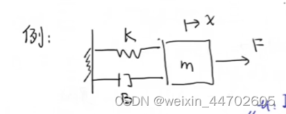

# 一 通过实例了解卡尔曼

1. 假设用尺子分别去量一枚硬币尺寸

   $$
   Z_1 = 50.1mm  \quad Z_2 = 50.2mm \quad Z_3 = 49.5mm
   $$

   $$
   Z_t 表示每次测量的结果
   $$
2. 第t次的测量结果可以用如下公式表示

   $$
   \begin{align*}
   \hat X_t & =  \frac 1t(Z_1 + Z_2 + Z_3+...+Z_t)\\
            & =  \frac1t(Z_1+Z_2+...+Z_{t-1})+\frac 1t.Z_t \\
   	 & = \frac1t.\frac{t-1}{t-1}(Z_1+Z_2+...+Z_{t-1})+\frac 1t.Z_t \\
   	 & = \frac1t.(t-1).\hat X_{t-1}+\frac 1t.Z_t \\
   	 & = \hat X_{t-1} - \frac{\hat X_{t-1}}t+\frac 1t.Z_t \\
   	 & = \hat X_{t-1} + \frac 1t(Z_t-\hat X_{t-1})
   \end{align*}
   $$

   $$
   \hat X_t 表示第t次的最优估计，随着次数的增加，\hat X_t 无限接近 \hat X_{t-1}
   $$

   $$
   令 K_t = \frac 1t\quad，则有:
   $$

   $$
   \color{green} \hat X_t = \hat X_{t-1} + K_t(Z_t-\hat X_{t-1}\tag1）
   $$
3. 上述绿色公式表示： 当前的估计值 =  上一时刻估计值 + 系数(当前测量值 - 上一时刻的估计值)
4. 根据估计误差和测量误差求卡尔曼增益

   $$
   假设估计误差为：e_{est} \quad, 测量误差为: e_{mea} \quad, 则有:
   $$

   $$
   \color{green}K_t = \frac{e_{est_{t-1}}}{e_{est_{t-1}}+e_{mea_t}}\tag2
   $$
5. 得到卡尔曼滤波更新的三个公式

   $$
   \begin{align*}
   K_t & = \frac{e_{est_{k-1}}}{e_{est_{k-1}}+e_{mea_k}} \\
   \hat X_t &= \hat X_{t-1} + K_t(Z_t-\hat X_{t-1})\\
   e_{est_t} &= (1-k_t).e_{est_{t-1}}
   \end{align*}
   $$

# 二 数据融合的思想理解卡尔曼滤波

1. 方差、 标准差、协方差的概念

   ```xml
   方差： 是指数据集合中各个数据与其平均值之差的平方和的平均值
   ```

$$
VAR(X) = \frac 1n\sum_1^n(x_i-\mu)
$$

```xml
标准差： 是方差的平方根，用于衡量数据集合中各个数据与其平方值的偏离程度
```

$$
SD(X)= \sqrt{VAR(X)}
$$

```xml
协方差： 用来衡量两个变量之间的总体相关程度， 如果有两个随机变量X，Y， 则其协方差的计算公式为：
```

$$
Cov(X,Y) = \frac1n\sum_{i=1}^n(x_i-\overline x)(y_i-\overline y)
$$

2. 实际例子理解方差、协方差、标准差

| 球员   | 身高  | 体重 | 年龄 |
| :----- | ----- | :--: | ---- |
| A      | 179   |  74  | 33   |
| B      | 187   |  80  | 31   |
| C      | 175   |  71  | 28   |
| 平均值 | 180.3 |  75  | 30.7 |

    根据方差的计算公式有：

$$
\begin{align*}
VAR(X) &= \frac13[(179-180.3)^2 + (187-180.3)^2+(175-180.3)^2] = 24.89 \\
VAR(Y) &= 14 \\
VAR(Z) &= 4.22

\end{align*}
$$

根据协方差计算公式：

$$
cov(X,Y) = \frac13[(179-180.3)(74-75)+(187-180.3)(80-75)+(175-180.3)(71-75)] = cov(Y,X)
$$

3. 数据融合举例
4. 卡尔曼滤波的状态空间表达

   

如图所示例，是一个弹簧阻尼系统， m代表质量， F代表力即系统输入u， K代表符复合系数， B代表阻尼系数

$$
m\ddot x + B\dot x + Kx = F
$$

$$
令x_1 = x,\ x_2 = \dot x \\  \dot x_1 = x_2 ,\ \dot x_2 = \ddot x
$$

$$
\begin{align*}
\dot x_1 &= x_2 \\
\dot x_2 &= \ddot x \\
	 &= \frac1m.u - \frac Bm.x_2 - \frac km.x_1
\end{align*}
$$

得到矩阵关系:

$$
\left[ \begin{matrix}
   \dot x_1 \\
   \dot x_2
  \end{matrix}
  \right] = \left[
 \begin{matrix}
   0 & 1 \\
   -\frac Km & -\frac Bm 
  \end{matrix}
  \right] \left[
 \begin{matrix}
   x_1 \\
   x_2 
  \end{matrix}
  \right] +\left[
\begin{matrix}
   0 \\
   \frac1m 
  \end{matrix}
  \right].u
$$

因此，得到第一个状态公式：

$$
\color{green}\dot X_t = AX_t+BU_t\tag3
$$

对于状态量位置和速度：

$$
z_1 = x = x_1\quad , z_2 = \dot x = x_2
$$

换成矩阵关系，得到：

$$
\left[ \begin{matrix}
   z_1 \\
   z_2
  \end{matrix}
  \right] = \left[
 \begin{matrix}
   1 & 0 \\
   0 & 1 
  \end{matrix}
  \right] \left[
 \begin{matrix}
   x_1 \\
   x_2 
  \end{matrix}
  \right]
$$

最后得到第二个状态方程：

$$
\color{green} Z_t = H.X_t\tag4
$$
