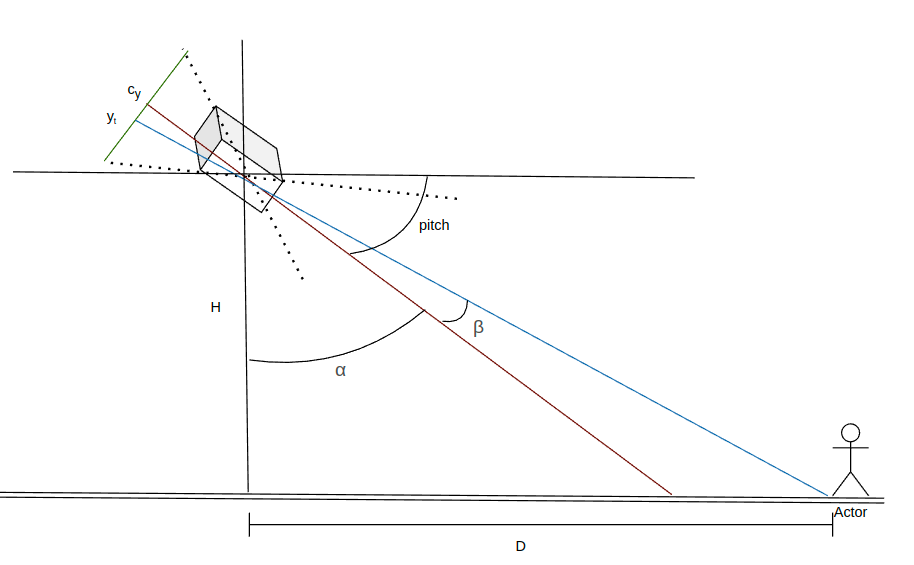
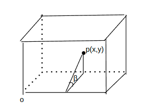
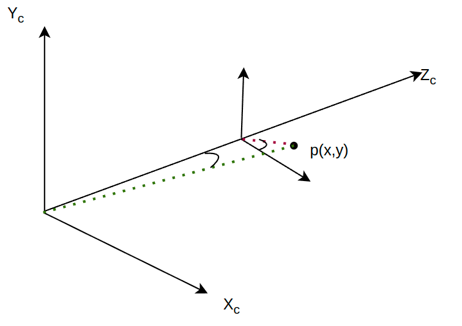

# 相机固定垂直与地面朝下

1. 像素点转换成图像点

   ```cpp
   float x = (undist_px - cx) / fx;
   float y = (undist_py - cy) / fy;
   ```
2. 图像坐标转FLU， 图像坐标系为x朝右，y向后；FLU为x朝前，y朝左; 下面公式遵循图像坐标系转相机坐标系原则

   ```cpp
   float flu_x = -1.f * h * y;
   float flu_y = -1.f * h * x;
   ```

# 根据姿态角计算距离

1. 根据图像点（x,y)计算yaw和pitch

   $$
   yaw = atan(x) \\
   pitch = \frac y {\sqrt{x^2 + 1}}
   $$
2. 根据云台pitch计算dist

   $$
   st = H * gimbal_{pitch}
   $$
3. 根据dist 和 yaw角度计算flu坐标

   $$
   flu_x = dist * cos(yaw)
   flu_y = -dist * sin(yaw)
   $$
4. 缺点

   ==计算的yaw是图像层面，没有包含无人机高度信息， 当高度升高后，测算的坐标变化不大==

# 基于上面方法优化



1. 计算公式

$$
D = H * tan(α-β) \tag1 \\
α = pi/2 - pitch \\
β = atan(y)
$$

2. 

   ```xml
   图中，0表示光心，p为图像上的投影点
   ```
3. $$
   β = atan(y)  \ , y是图像坐标
   $$
4. 根据上述，可以得到D， D表示FLU向前的距离， 用flu_x表示
5. 得到flu_x之后可以得到深度：

   $$
   dist = \sqrt{flu_x ^2 + H^2}
   $$
6. 计算yaw角
   

   ```xml
      正确的yaw角应该是绿色虚线与Zc的夹角
   ```
   $$
   \begin{align*}
   yaw &= atan(flu_y / flu_x) \\
          &= atan(y*dist/flu_x)
   \end{align*}
   $$
