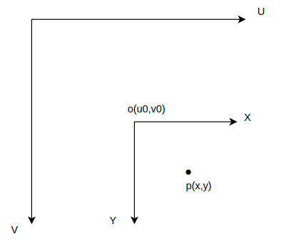
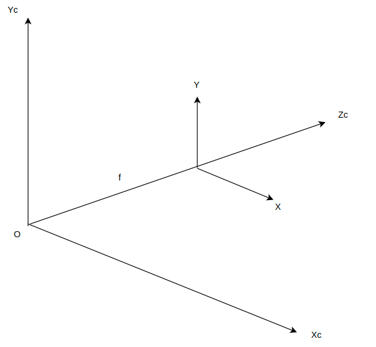

# 像素坐标转图像坐标



$$
\left \{

\begin{array}{c}

{x = \frac {(u-u_0)} {d_x}  }\\

{y = \frac {(v-v_0)} {d_y}} \tag1

\end{array}

\right.
$$

```markdown
UV表示像素坐标系，XY表示图像坐标系
将p点坐标(u,v) , 转换成(x,y), dx,dy表示一个像素的尺寸
```

# 图像转相机



$$
\left \{

\begin{array}{c}

{x_c = \frac {Z_c.x} {f}  }\\

{y_c = \frac {Z_c.y} {f}} \tag1

\end{array}

\right.
$$

```markdown
公式根据相似性原理，归一化坐标系下f可忽略， Zc表示相机到目标的距离
```
